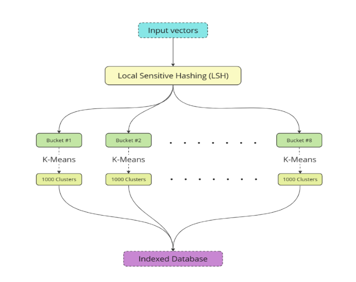
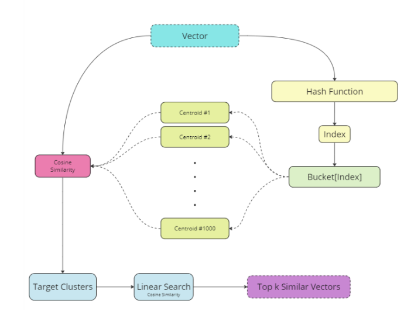
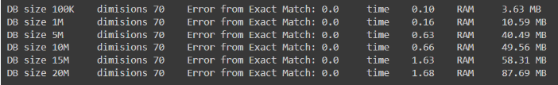
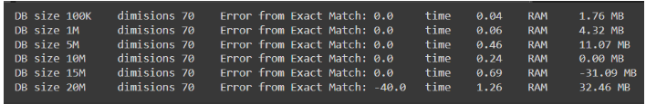
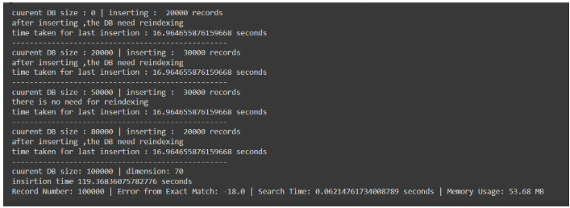

# Hyperd Scalable Indexer

A scalable vector indexing system designed to balance **high recall**, **time efficiency**, and **memory optimization**. The project explores two indexing strategies inspired by **LSH** and **IVFFLAT**, with a focus on rebuildability, parallelization, and disk-based storage.

> The indexer assumes it is built on the full dataset. When new data arrives, the index can be **rebuilt in parallel** while efficiently using disk to minimize RAM usage.

---

## Features

- High scalability for large-scale vector datasets
- Efficient speed–recall tradeoff
- Disk-based storage for centroids and clusters
- Parallelizable rebuild process
- Supports approximate nearest neighbor (ANN) search

---

## 1. Two-Layer Indexer (LSH + IVFFLAT)

### Overview

This strategy combines **Locality Sensitive Hashing (LSH)** as a coarse-grained partitioning layer with **K-Means clustering (IVFFLAT-style)** as a fine-grained indexing layer.

The goal is to reduce the search space aggressively using LSH, then apply IVFFLAT inside each bucket to improve recall while maintaining fast query times.

---

### Indexing Architecture

#### Layer 1: LSH Bucketing

- Three random projection vectors are used for LSH.
- For each input vector:

  - Cosine similarity is computed against the 3 LSH vectors.
  - A threshold is applied to each similarity score.
  - Each score is converted to either `0` or `1`.
  - The result is a **3-bit binary code**, producing **8 possible buckets**.

- Each vector is assigned to one of the 8 subdomain buckets.

#### Layer 2: IVFFLAT (K-Means per Bucket)

- For each LSH bucket:

  - K-Means clustering is applied.
  - Number of clusters per bucket: **1000**.
  - `sklearn.KMeans` is used with `fit()`.

- Output per bucket:

  - 1000 cluster centroids
  - Records belonging to each cluster

- Centroids and cluster assignments are persisted to disk for retrieval.

---

### Retrieval Architecture

Given a query vector:

1. Apply the same LSH hashing process:

   - Compute cosine similarity with the same 3 LSH vectors.
   - Apply thresholds to generate a 3-bit bucket index.

2. **Multi-bucket probing**:

   - Instead of searching only the hashed bucket, neighboring buckets are also searched to improve recall.

3. Load centroids for the selected buckets from disk.

4. Compute cosine similarity between the query and centroids.

5. **Multi-cluster probing**:

   - Search multiple nearest clusters (`nprobes`) instead of a single cluster.

6. Perform linear search inside the selected clusters using cosine similarity.

7. Collect and merge results from all searched clusters and buckets.

8. Sort final results and return the top **k** nearest vectors.

---

### Experimental Results

**Configuration 1**

- LSH buckets: 8
- LSH nprobes: 6
- IVFFLAT clusters per bucket: 1000
- IVFFLAT nprobes: 150
  

**Configuration 2**

- LSH buckets: 8
- LSH nprobes: 6
- IVFFLAT clusters per bucket: 1000
- IVFFLAT nprobes: 50
  

> A reported result of `-40` means the retrieved ID is 40 positions away from the optimal answer. This is acceptable when operating at scales of **~20 million vectors**.

---

## 2. Single IVFFLAT with Incremental Insertion

### Overview

This approach follows a **single-layer IVFFLAT strategy** with dynamic data insertion and periodic re-clustering to maintain cluster quality.

---

### Indexing Strategy

- Start with **empty clusters**.
- Initially:

  - Each inserted record becomes a new cluster centroid.

- For subsequent inserts:

  - Each record is assigned to the nearest centroid (cosine similarity).

---

### Reindexing Policy

- Reindexing is triggered when:

  - The dataset size becomes **double** the size at the last indexing stage.

- Re-clustering is designed to:

  - Minimize RAM usage
  - Leverage disk-based storage
  - Avoid blocking the system during rebuilds

---

### Experimental Results

- Number of clusters: **1000**
- nprobes: **150**
- Vector dimension: **70 (float)**
- Total inserted vectors: **100K**
- Inserted in 4 chunks:

  - 20K
  - 30K
  - 30K
  - 20K
    

**Observation**:

- At the third insertion chunk, **no reindexing was required**, indicating stable clustering quality.
